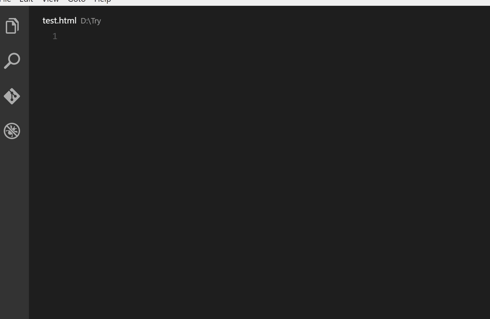
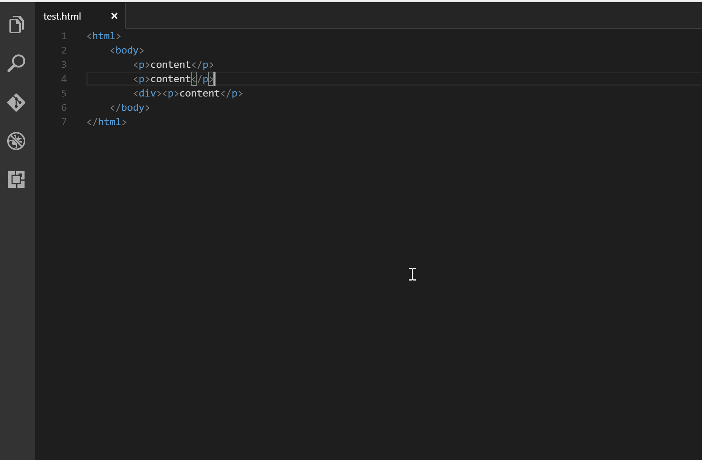
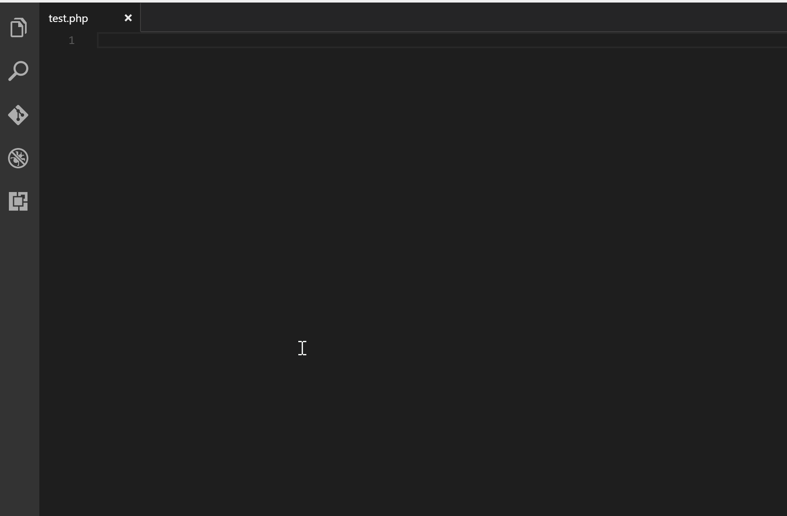

# Auto Close Tag

[](https://marketplace.visualstudio.com/items?itemName=formulahendry.auto-close-tag) [](https://marketplace.visualstudio.com/items?itemName=formulahendry.auto-close-tag) [](https://marketplace.visualstudio.com/items?itemName=formulahendry.auto-close-tag) [](https://travis-ci.org/formulahendry/vscode-auto-close-tag)

Automatically add HTML/XML close tag, same as Visual Studio IDE or Sublime Text does.

## Sponsors

[](http://wd5a.2.vu/1)<br>
Increase your coding productivity with Tabnine’s AI code completions! Tabnine is a free powerful Artificial Intelligence assistant designed to help you code faster, reduce mistakes, and discover best coding practices - without ever leaving the comfort of VS Code.<br>
Tabnine is trusted by more than a million developers worldwide. [Get it now](http://wd5a.2.vu/1).

<p><a title="Try CodeStream" href="https://sponsorlink.codestream.com/?utm_source=vscmarket&amp;utm_campaign=autoclosetag&amp;utm_medium=banner"></a><br>
Eliminate context switching and costly distractions. Create and merge PRs and perform code reviews from inside your IDE while using jump-to-definition, your keybindings, and other IDE favorites.<br> <a title="Try CodeStream" href="https://sponsorlink.codestream.com/?utm_source=vscmarket&amp;utm_campaign=autoclosetag&amp;utm_medium=banner">Learn more</a></p>

[](https://bit.ly/3yudkl3)<br>
Track and prioritise tech debt and maintenance issues, straight from your IDE. Bookmark code while you work, organise TODOs and share codebase knowledge with your team. [Try it out for free today](https://bit.ly/3yudkl3).

[](https://bloop.ai/?utm_source=vscmarket&utm_campaign=formulahendry&utm_medium=banner)<br>
Bored of trawling through the docs? Get JS and TS code examples from documentation and Open Source right in your IDE. [Learn more](https://bloop.ai/?utm_source=vscmarket&utm_campaign=formulahendry&utm_medium=banner).

## Book for VS Code

[《Visual Studio Code 权威指南》](https://union-click.jd.com/jdc?e=jdext-1261348777639735296-0&p=AyIGZRhbHQsWAVIaXxEyEgRdG1sRBxU3EUQDS10iXhBeGlcJDBkNXg9JHUlSSkkFSRwSBF0bWxEHFRgMXgdIMkRxFAUJD1RQZT0cBnwKDE4%2BaDpgB2ILWStbHAIQD1QaWxIBIgdUGlsRBxEEUxprJQIXNwd1g6O0yqLkB4%2B%2FjcePwitaJQIWD1cfWhwKGwVSG1wlAhoDZc31gdeauIyr%2FsOovNLYq46cqca50ytrJQEiXABPElAeEgRSG1kQCxQBUxxZHQQQA1YTXAkDIgdUGlscChECXRs1FGwSD1UbWRALFwRWK1slASJZOxoLRlUXU1NONU9QEkdXWRlJbBUDVB9TFgAVN1caWhcA)：带你深入浅出 VS Code！


## Note

From VS Code 1.16, it has [built-in close tag support](https://code.visualstudio.com/updates/v1_16#_html-close-tags) for HTML, Handlebars and Razor files. This extension is enabled for other languages like XML, PHP, Vue, JavaScript, TypeScript, JSX, TSX and so on. It is configurable.

## Features

* Automatically add closing tag when you type in the closing bracket of the opening tag
* After closing tag is inserted, the cursor is between the opening and closing tag
* Set the tag list that would not be auto closed
* Automatically close self-closing tag
* Support auto close tag as Sublime Text 3
* Use Keyboard Shortcut or Command Palette to add close tag manually

## Usages

After typing in the closing bracket of the opening tag, the closing tag will be inserted automatically.



To add close tag manually, use shortcut `Alt+.` (`Command+Alt+.` for Mac), or press `F1` and then select/type `Close Tag`



## Sublime Text 3 Mode

To automatically add close tag when `</` is typed (same as Sublime Text 3 does), set the below config as `true`:
```json
{
    "auto-close-tag.SublimeText3Mode": true
}
```
The setting is `false` by default.



## Configuration

Use `auto-close-tag.enableAutoCloseTag` to set whether to insert close tag automatically (it is `true` by default):
```json
{
    "auto-close-tag.enableAutoCloseTag": true
}
```

To set whether to close self-closing tag automatically (e.g. type `<br`, then type `/`, `>` will be added automatically) (it is `true` by default):
```json
{
    "auto-close-tag.enableAutoCloseSelfClosingTag": true
}
```

Whether to insert a space before the forward slash in a self-closing tag (it is `false` by default):
```json
{
    "auto-close-tag.insertSpaceBeforeSelfClosingTag": false
}
```

Add entry into `auto-close-tag.activationOnLanguage` to set the languages that the extension will be activated. Use `["*"]` to activate for all languages. Below are the default settings:
```json
{
    "auto-close-tag.activationOnLanguage": [
        "xml",
        "php",
        "blade",
        "ejs",
        "jinja",
        "javascript",
        "javascriptreact",
        "typescript",
        "typescriptreact",
        "plaintext",
        "markdown",
        "vue",
        "liquid",
        "erb",
        "lang-cfml",
        "cfml",
        "HTML (Eex)"
    ]
}
```
**Note:** The setting should be set with language id defined in [VS Code](https://github.com/Microsoft/vscode/tree/master/extensions). Taking [javascript definition](https://github.com/Microsoft/vscode/blob/master/extensions/javascript/package.json) as an example, we need to use `javascript` for `.js` and `.es6`, use `javascriptreact` for `.jsx`. So, if you want to enable this extension on `.js` file, you need to add `javascript` in settings.json.

Alternatively you could also exlude the languages where you don't want the extension to be activated. Below is an example:
```json
{
    "auto-close-tag.disableOnLanguage": [
        "php",
        "python"
    ]
}
```

You could also set the tag list that would not be auto closed. Below are the default settings for void elements in HTML per [W3C spec](https://www.w3.org/TR/html-markup/syntax.html#syntax-elements), and you could overwrite it:
```json
{
    "auto-close-tag.excludedTags": [
        "area",
        "base",
        "br",
        "col",
        "command",
        "embed",
        "hr",
        "img",
        "input",
        "keygen",
        "link",
        "meta",
        "param",
        "source",
        "track",
        "wbr"
    ]
}
```

`auto-close-tag.fullMode`: Whether to enable both Visual Studio and Sublime Text mode. (Default is **false**)

## Change Log
See Change Log [here](CHANGELOG.md)

## Issues
Submit the [issues](https://github.com/formulahendry/vscode-auto-close-tag/issues) if you find any bug or have any suggestion.

## Contribution
Fork the [repo](https://github.com/formulahendry/vscode-auto-close-tag) and submit pull requests.

## Blog
Visit the [blog](https://blogs.msdn.microsoft.com/formulahendry) or the [post](https://blogs.msdn.microsoft.com/formulahendry/2016/06/29/auto-close-tag-for-visual-studio-code/) for more detailed info 